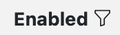
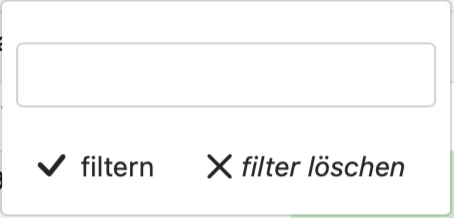
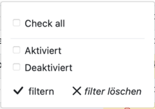

# Examples

## Table of Contents

- [Full Example](#Full-Example)
- [HTML output](#HTML-output)

## Full Example

```php
// Table
$table = new Table("table");
$table->Small()->Hover()->Striped();
$table->Uri('table');
$table->addRequest( \Config\Services::request() );
$table->addModel( $this->model );

// Options
$options["enabled"] = ["1"=>"Aktiviert","0"=>"Deaktiviert"];

// THead
$th = $table->Thead();
$th->Th('#')           ->Field('id')      ->Sort();
$th->Th("Benutzername")->Field("username")->Sort()->Filter();
$th->Th("Vorname")     ->Field("surname") ->Sort()->Filter();
$th->Th("Nachname")    ->Field("lastname")->Sort()->Filter();
$th->Th("Password")    ->Field("password")->Sort()->Filter();
$th->Th("SID")         ->Field("sid")     ->Sort()->Filter();
$th->Th("Enabled")     ->Field("enabled") ->Sort()->Filter("checkbox",$options["enabled"]);
$th->Th("Test Datum")  ->Field("testdate")->Sort()->Filter();
$th->Th("Test JSON")   ->Field("testjson")->Sort()->Filter();
$th->Th("");

// TBody
$tb = $table->Tbody();
$tb->Th('id');
$tb->Td('username');
$tb->Td()->Html("{surname}", '["{surname}","==","Ralf"]')
	     ->Success("{surname}","==","Ralf");
$tb->Td('lastname');
$tb->Td('password');
$tb->Td('sid');
$tb->Td('enabled')->Center()
                  ->Icon('file-earmark-person','["{enabled}","==","0"]','text-danger')
                  ->Icon('file-earmark-person','["{enabled}","==","1"]','text-success')
                  ->Html(' {enabled}', '', $options)
                  ->Warning("{enabled}","==","0");
$tb->Td('testdate')->Icon('file-earmark-person', '["{testdate}","==",""]')
                   ->Html('{testdate}', '["{testdate}","!=",""]');
$tb->Td('testjson');
$tb->Td()->addClass("py-1")->Right()->Html('
<div class="btn-group" role="group">
<button type="button" class="btn btn-sm btn-outline-secondary">Left {id}</button>
<button type="button" class="btn btn-sm btn-outline-primary">Middle</button>
<button type="button" class="btn btn-sm btn-outline-danger">Right</button>
</div>');

#d($table);


$data = [
	'table'   => $table,
];

return view('TableTest', $data);	

#d($form->toHtml());

```

## Table

In CodeIgniter 4 Controller

### Table ID
```php
$table = new Table("tableid");
// or
$table->Id("tableid");
```

### Table Caption
```php
$table->Caption("Table Caption");
```

### Table Classes
```php
$table->addClass("myclass");             // myclass 
$table->addClass("myclass1 myclass2");   // myclass1 myclass2 
```

### Bootstrap Table Classes
```php
$table->Small();       // table-sm
$table->Dark();        // table-dark
$table->Light();       // table-light
$table->Striped();     // table-striped
$table->Bordered();    // table-bordered
$table->Borderless();  // table-borderless
$table->Hover();       // table-hover
```

### Codeigniter Uri
```php
// https://your.site.com/table
$table->Uri('table');
```

### Codeigniter Request and Model
```php
$table->addRequest( \Config\Services::request() );
$table->addModel( $this->model );
```

## Thead Full Example

```php
// Options
$options["enabled"] = ["1"=>"Aktiviert","0"=>"Deaktiviert"];

// THead
$th = $table->Thead();
$th->Th('#');
$th->Th("Benutzername")->Field("username")->Sort()->Filter();
$th->Th("Vorname")     ->Field("surname") ->Sort()->Filter();
$th->Th("Nachname")    ->Field("lastname")->Sort()->Filter();
$th->Th("Password")    ->Field("password")->Sort()->Filter();
$th->Th("SID")         ->Field("sid")     ->Sort()->Filter();
$th->Th("Enabled")     ->Field("enabled") ->Sort()->Filter("checkbox",$options["enabled"]);
$th->Th("Test Datum")  ->Field("testdate")->Sort()->Filter();
$th->Th("Test JSON")   ->Field("testjson")->Sort()->Filter();
$th->Th(""); // a column for action buttons
```
### Add Table Columns

```php
$th = $table->Thead();
$th->Th('Col1');
$th->Th('Col2');
$th->Th('Col3');
$th->Th('Col4');
```

### Make Table Column Sortable
To make a table column sortable, you must set the sorted field.

```php
$th->Th("Benutzername")->Field("username")->Sort();
```

### Make Table Column Filterable
To make a table column filterable, you must set the filtered field.
As default, a textfield is used to filter a column. In this case you can write a 0 (disabled) or a 1 (enabled) in the textfield.


```php
// Options
$th->Th("Enabled")->Field("enabled")->Filter();
```


You can choose to display the filter as a group of checkboxes. An array with the options must be transferred for this.
```php
$options["enabled"] = ["1"=>"Aktiviert","0"=>"Deaktiviert"];
$th->Th("Enabled")->Field("enabled")->Sort()->Filter("checkbox",$options["enabled"]);
```


In CodeIgniter 4 View

```html
<?= $form->toHtml() ?>
```

